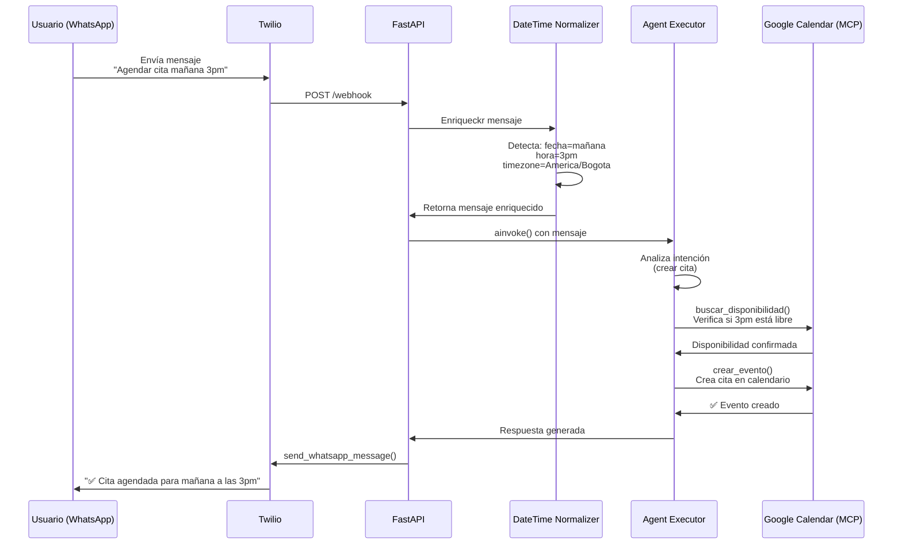

# TurnoAI 📅🤖

**TurnoAI** es un asistente de agendamiento de citas potenciado por IA que permite a los usuarios gestionar sus citas de forma natural y conversacional a través de WhatsApp.

## 📋 Descripción General

TurnoAI es una solución integral que conecta:

- **WhatsApp** (via Twilio Sandbox) para recibir y enviar mensajes
- **Google Calendar** (via MCP - Model Context Protocol) para gestionar la agenda del usuario
- **Modelos de IA** (OpenAI) para procesar lenguaje natural y tomar decisiones

El usuario simplemente escribe en WhatsApp lo que necesita ("Agendar cita mañana a las 3pm", "¿Cuáles son mis citas del viernes?", "Cancela mi cita de barbería") y el agente de IA interpreta la solicitud, consulta el calendario y realiza las acciones necesarias.

## ✨ Características Principales

- 📱 **WhatsApp Bot**: Agendamiento completo de citas a través de WhatsApp
- 🤖 **Conversación Natural**: Entiende solicitudes en lenguaje natural gracias a los LLMs
- 📅 **Sincronización Google Calendar**: Conecta directamente con Google Calendar para evitar conflictos de horarios
- 🔧 **MCP (Model Context Protocol)**: Integración estándar con Google Calendar via MCP
- 🌐 **Zona Horaria Inteligente**: Soporte automático para diferentes zonas horarias (configurable)
- 🧪 **Modo Testing**: Opción de ejecutar con Twilio Fake para desarrollo sin costos
- ⚡ **Stack Moderno**: Python, FastAPI, LangChain, LangGraph

## 🏗️ Arquitectura

```
┌─────────────┐           ┌──────────────┐           ┌──────────────────┐
│  WhatsApp   │           │   FastAPI    │           │  Google Calendar │
│   Usuario   ├──Webhook─→│   Server     ├──MCP─────→│    (via MCP)     │
│  (Twilio)   │           │              │           └──────────────────┘
└─────────────┘           └────┬─────────┘                    ▲
                               │                              │
                               ├─ Enriquece Mensaje           │
                               │  (Normaliza fechas/horas)    │
                               │                              │
                               ├─ Agent Executor ────────────┘
                               │  (LangGraph + OpenAI)
                               │
                               └─ Envía respuesta por WhatsApp
```

### Flujo de Operación

Este flujo se puede visualizar en https://mermaid.ai/live/edit



## 🚀 Inicio Rápido

### Requisitos Previos

- Python 3.10+
- Git
- Cuenta de Google con acceso a Google Calendar
- Cuenta de Twilio (Sandbox)
- API Key de OpenAI
- MCP Server de Google Calendar (ejecutándose localmente)

### Instalación

1. **Clonar el repositorio**

```bash
git clone https://github.com/JuanPaz98/TurnoAI
cd TurnoAI
```

2. **Crear entorno virtual**

```bash
python -m venv .venv
source .venv/Scripts/activate  # En Windows
# source .venv/bin/activate    # En macOS/Linux
```

3. **Instalar dependencias**

```bash
pip install -r requirements.txt
```

4. **Configurar variables de entorno**

```bash
cp .env-example .env
# Editar .env con tus valores reales
```

5. **Ejecutar la aplicación**

```bash
uvicorn main:app --reload
```

## 🔧 Configuración

### Variables de Entorno

Todas las variables de entorno van en el archivo `.env`. Consulta [.env-example](.env-example) para ver la estructura completa.

#### Google Calendar (MCP)

- **CALENDAR_MCP_SERVER_URL**: URL del MCP Server de Google Calendar
  - Ejemplo: `http://localhost:8000`
  - Este servidor debe estar ejecutándose en tu máquina local

#### Twilio (WhatsApp)

- **TWILIO_ACCOUNT_SID**: SID de tu cuenta Twilio
- **TWILIO_AUTH_TOKEN**: Token de autenticación de Twilio
- **TWILIO_WHATSAPP_NUMBER**: Número de WhatsApp asignado por Twilio
  - Formato: `whatsapp:+1234567890`
- **USE_TWILIO_FAKE**: `true` para modo testing (sin enviar mensajes reales)
  - Valores: `true` o `false`

#### OpenAI

- **OPENAI_API_KEY**: Tu API Key de OpenAI

#### Zona Horaria

- **TIMEZONE**: Zona horaria para las citas (por defecto: `America/Bogota`)

### Configuración de Twilio Webhook

Para recibir mensajes de WhatsApp, debes configurar el webhook en Twilio:

1. Ve a [Twilio Console](https://console.twilio.com)
2. Navega a **Messaging > Services > WhatsApp**
3. En la sección **Inbound Message URL**, configura:
   ```
   https://tu-dominio.com/webhook
   ```
   (En desarrollo local, usa ngrok: `https://tu-ngrok-id.ngrok.io/webhook`)

## 🧪 Desarrollo Local

### Opción 1: Modo Fake (Sin Twilio Real)

Perfecto para desarrollo sin costos:

```bash
# En .env:
USE_TWILIO_FAKE=true
```

Luego ejecuta:

```bash
uvicorn main:app --reload
```

Los mensajes se simularán en la consola.

### Opción 2: Con Twilio Sandbox Real

1. Obtén credenciales de Twilio
2. Configura las variables en `.env`:

   ```env
   TWILIO_ACCOUNT_SID=your_sid
   TWILIO_AUTH_TOKEN=your_token
   TWILIO_WHATSAPP_NUMBER=whatsapp:+1234567890
   USE_TWILIO_FAKE=false
   ```

3. Expone tu servidor local con ngrok:

```bash
ngrok http 8000
# Copia la URL https de ngrok
```

4. Configura el webhook en Twilio Console con la URL de ngrok

### Eksponer Localmente con ngrok

```bash
# Instalar ngrok
# (descarga desde https://ngrok.com)

# Exponer puerto 8000
ngrok http 8000

# Copia la URL y configúrala en Twilio
```

## 📝 Ejemplos de Uso

### Crear una Cita

**Usuario:**

```
Agendar corte mañana a las 3pm
```

**TurnoAI:**

```
✅ Cita agendada con éxito
📅 'Corte' creado para mañana a las 3pm
```

### Consultar Citas

**Usuario:**

```
¿Cuáles son mis citas del viernes?
```

**TurnoAI:**

```
📅 Tus citas del viernes:
• 10:00 AM - Corte de cabello
• 2:00 PM - Manicure
```

### Cancelar una Cita

**Usuario:**

```
Cancela mi cita de barbería
```

**TurnoAI:**

```
✅ Cita de barbería cancelada exitosamente
```

### Cambiar Fecha/Hora

**Usuario:**

```
Mueve mi cita de mañana a pasado mañana a las 4pm
```

**TurnoAI:**

```
✅ Cita actualizada
📅 Cambio: mañana 3pm → pasado mañana 4pm
```

## 📂 Estructura del Proyecto

```
TurnoAI/
├── main.py                          # Punto de entrada, FastAPI app y endpoints
├── requirements.txt                 # Dependencias del proyecto
├── .env-example                     # Template de variables de entorno
├── README.md                        # Este archivo
│
├── services/
│   ├── agent_service.py            # Creación del agente y herramientas
│   ├── calendar_service.py         # Operaciones con Google Calendar (MCP)
│   └── datetime_normalizer.py      # Normalización de fechas/horas
│
├── prompts/
│   ├── initial_prompt.py           # System prompt del agente de IA
│   └── __init__.py
│
└── tests/
    ├── test_agent.py               # Tests del agente
    └── __init__.py
```

### Componentes Principales

#### `main.py`

- FastAPI application
- Lifespan management (inicializa el agente)
- Endpoint `/webhook` que recibe mensajes de WhatsApp
- Funciones para enviar mensajes reales vs fake

#### `services/agent_service.py`

- Creaación del ReAct Agent con LangGraph
- Definición de tools disponibles para el agente:
  - `buscar_disponibilidad`: Verifica horarios libres
  - `crear_evento`: Crea cita en Google Calendar
  - `buscar_eventos_por_texto_tool`: Busca citas por keyword
  - `actualizar_evento`: Modifica cita existente
  - `cancelar_evento`: Elimina cita

#### `services/calendar_service.py`

- Comunicación con Google Calendar via MCP
- Operaciones CRUD de eventos
- Parseo de respuestas del MCP Server

#### `services/datetime_normalizer.py`

- Detecta expresiones de fecha relativa ("mañana", "hoy", "pasado mañana")
- Detecta horas (3pm, 15:00, etc.)
- Enriquece el mensaje del usuario con metadata de fecha/hora

#### `prompts/initial_prompt.py`

- System prompt del agente
- Instrucciones sobre cómo usar las tools
- Reglas de comportamiento y respuestas

## 🔌 Herramientas del Agente

El agente tiene acceso a las siguientes herramientas (tools):

### `buscar_disponibilidad(start, end)`

Verifica si un rango horario está libre en el calendario.

```
Input:
  - start: "2026-03-23T14:00:00"
  - end: "2026-03-23T15:00:00"
Output:
  - disponible: true/false
  - eventos: [lista de eventos que conflictúan]
```

### `crear_evento(titulo, fecha_inicio, fecha_fin)`

Crea una nueva cita en Google Calendar.

```
Input:
  - titulo: "Corte de cabello"
  - fecha_inicio: "2026-03-24T15:00:00"
  - fecha_fin: "2026-03-24T16:00:00"
Output:
  - status: "✅ Cita agendada"
  - event_id: "abc123xyz"
```

### `buscar_eventos_por_texto_tool(query)`

Busca citas usando palabras clave.

```
Input:
  - query: "barbería"
Output:
  - Lista de eventos que coincidan
```

### `actualizar_evento(event_id, titulo, fecha_inicio, fecha_fin)`

Modifica una cita existente.

### `cancelar_evento(event_id)`

Elimina una cita del calendario.

## 🧠 Lógica del Agente

El agente es un **ReAct Agent** (Reasoning + Acting) basado en LangGraph:

1. **Razonamiento**: Lee el mensaje y decide qué tools usar
2. **Actuación**: Ejecuta las tools necesarias
3. **Observación**: Analiza los resultados
4. **Iteración**: Si hay información insuficiente, pide más detalles al usuario

## 📋 Checklist de Setup Completo

- [ ] Python 3.10+ instalado
- [ ] Repositorio clonado
- [ ] `.venv` creado y activado
- [ ] `requirements.txt` instalado
- [ ] `.env` configurado con todas las variables
- [ ] MCP Server de Google Calendar ejecutándose
- [ ] Credenciales de Twilio obtenidas
- [ ] Webhook de Twilio configurado (o ngrok si es local)
- [ ] OpenAI API Key agregada a `.env`
- [ ] Aplicación ejecutada: `uvicorn main:app --reload`

## 🚨 Troubleshooting

### Error: "No module named 'mcp'"

```bash
pip install mcp
```

### Error: "CALENDAR_MCP_SERVER_URL not found"

- Verifica que el MCP Server de Google Calendar esté ejecutándose
- Revisa que la URL en `.env` sea correcta (ej: `http://localhost:8000`)

### Error: "TWILIO_ACCOUNT_SID not found"

- Configura todas las variables en el archivo `.env`
- No olvides las variables de Twilio si usas `USE_TWILIO_FAKE=false`

### Los mensajes de WhatsApp no se reciben

- Verifica que el webhook en Twilio apunte a la URL correcta
- Si usas ngrok, asegúrate de que esté ejecutándose
- Revisa los logs de FastAPI para errores

## 📚 Recursos Adicionales

- [Twilio WhatsApp Sandbox](https://www.twilio.com/en-us/messaging/channels/whatsapp)
- [Google Calendar API](https://developers.google.com/calendar)
- [LangChain Documentation](https://python.langchain.com)
- [FastAPI Documentation](https://fastapi.tiangolo.com)

## 📄 Licencia

Ver archivo [LICENSE](LICENSE)

---

**Hecho con ❤️ para automatizar la gestión de citas**
